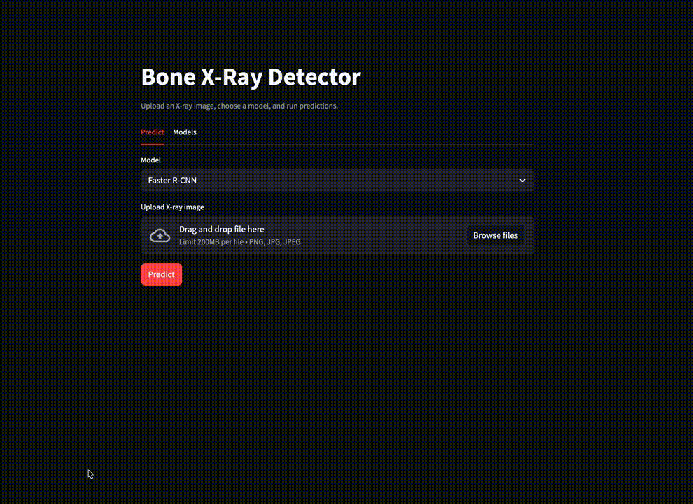

# Bone X‑Ray Fracture Detector
<p align="center">
  
  
  
  
  
  
  
  
</p>

An application for fracture detection on X‑ray images: Streamlit UI + two detectors (Detectron2 Faster R‑CNN and Ultralytics YOLO) with background metric computation via Celery/Redis.


---

## Highlights

- One UI for two models: Faster R‑CNN (Detectron2) and YOLO (Ultralytics).
- Asynchronous metric computation via Celery + Redis without blocking the UI.
- Metrics cache in `cache/` with instant reuse.
- Unified 6‑class evaluation protocol (merge `humerus fracture → humerus`) for model comparison.
- Metrics: COCO AP + FROC/Sensitivity@FP‑per‑image.
- Full stack runs via Docker Compose.

---

## Demo


<summary><b>Demo (gif/video)</b></summary>
<p></p>


---

## Architecture

Flow: Streamlit UI accepts an image → basic preprocessing (PIL‑RGB, BGR for Detectron2) → model inference → post‑processing/box visualization → metrics are computed in the background via Celery and cached in `cache/`.

---

## How I approached the task

- Analyzed YOLO‑seg labels and class distribution.
- Merged `humerus fracture` into `humerus` because that class has only 3 objects in the original labels.
- Built a unified evaluation protocol via COCO‑JSON and class mapping.
- Implemented a shared inference flow and a unified detection format for visualization.
- Moved metric computation to a Celery queue and added cache + lock mechanism.
- Packaged the app, worker, and Redis in Docker Compose.
- Training was tracked in a research notebook:
  - YOLO: 50 epochs, `imgsz=640`.
  - Faster R‑CNN: `NUM_CLASSES=6`, `imgsz=1024`, `FILTER_EMPTY_ANNOTATIONS=False` (includes images without fractures).
- All data, including images without fractures, were used for training.
- The dataset already contains augmentations; additional augmentation did not improve results.

---

## Problems and solutions

- Different class schemes (7 vs 6) → class merge + mapping → comparable metrics.
- YOLO‑seg labels → COCO conversion → correct COCOeval.
- Detectron2 expects BGR → explicit RGB→BGR conversion → correct inference.
- Long metric computation → Celery + Redis + cache → responsive UI.

---

## Results

<table>
  <thead>
    <tr>
      <th align="left">Model</th>
      <th align="center">AP50‑95</th>
      <th align="center">AP50</th>
      <th align="center">Sens@1 FP/image</th>
    </tr>
  </thead>
  <tbody>
    <tr>
      <td><b>Faster R‑CNN</b></td>
      <td align="center"><b>0.0881</b></td>
      <td align="center"><b>0.2707</b></td>
      <td align="center"><b>0.4706</b></td>
    </tr>
    <tr>
      <td><b>YOLO</b> (6‑class)</td>
      <td align="center"><b>0.0584</b></td>
      <td align="center"><b>0.1602</b></td>
      <td align="center"><b>0.2353</b></td>
    </tr>
  </tbody>
</table>

Interpretation: under this protocol, Faster R‑CNN shows higher Sens@1 FP/image at the same evaluation settings.

---

## Run

### Docker Compose
```bash
docker compose up --build
```
Open: `http://localhost:8501`

### Local
```bash
python -m venv .venv
.venv/bin/pip install -r requirements.txt
# compute metrics once at server start, then run Streamlit
./scripts/start_server.sh
```

### Weights (Hugging Face)
If weights are not found locally in `weights/`, the app will try to download them from Hugging Face.
Set the repository and filenames via environment variables:
```bash
export HF_REPO_ID=your_hf_repo_id
export HF_FILENAME_FRCNN=model_final_frcnn.pth
export HF_FILENAME_YOLO=best_yolo26m_640.pt
```
If the repo is private, also set `HUGGINGFACE_HUB_TOKEN`.

### Metrics (Hugging Face)
You can compute metrics locally and publish them to a Hugging Face dataset repo.
The server UI will download them automatically when these env vars are set:
```bash
export HF_METRICS_REPO_ID=your_hf_dataset_repo
export HF_METRICS_REPO_TYPE=dataset
export HF_METRICS_FILENAME_FRCNN=metrics_frcnn.json
export HF_METRICS_FILENAME_YOLO=metrics_yolo.json
```

Local upload flow:
```bash
export HF_METRICS_REPO_ID=your_hf_dataset_repo
python scripts/compute_metrics.py
```

---


## Data and download

**Source:** Kaggle dataset `pkdarabi/bone-fracture-detection-computer-vision-project`  
**Author:** pkdarabi (Kaggle)  
**License:** CC BY 4.0 (listed in `data/BoneFractureYolo8/data.yaml`)  
**Description:** a set of upper‑extremity X‑ray images with fracture annotations by class; annotations are provided as bounding boxes or pixel‑level segmentation masks.  
**Classes (7):** Elbow Positive, Fingers Positive, Forearm Fracture, Humerus Fracture, Humerus, Shoulder Fracture, Wrist Positive.  
**Notes:** the dataset already includes augmentations (rotations, brightness/contrast changes). The split contains images without fractures (empty label files).

**Download and place in the expected folder** (required for conversion and metric computation):

```bash
pip install kaggle

# place kaggle.json into ~/.kaggle/ (Kaggle API access)
kaggle datasets download -d pkdarabi/bone-fracture-detection-computer-vision-project -p data --unzip
```

Expected structure (used in `app/config.py` and for metrics):
```
data/BoneFractureYolo8/
  train/images, train/labels
  valid/images, valid/labels
  test/images,  test/labels
```
If the extracted folder has a different name, rename it to `BoneFractureYolo8`.

Dataset citation DOI: `10.13140/RG.2.2.14400.34569`  
ResearchGate: `https://www.researchgate.net/publication/382268240_Bone_Fracture_Detection_Computer_Vision_Project`

---

## Limitations and next steps

- Metrics are valid only for the current split; no external validation.
- Training is documented in a notebook, not a fully reproducible pipeline/script.
- Results depend on label quality and imaging source.
- Data are not stored in the repo and must be downloaded separately (see “Data and download”).
- No clinical/regulatory validation; this is not a medical device and is intended for research/education.
